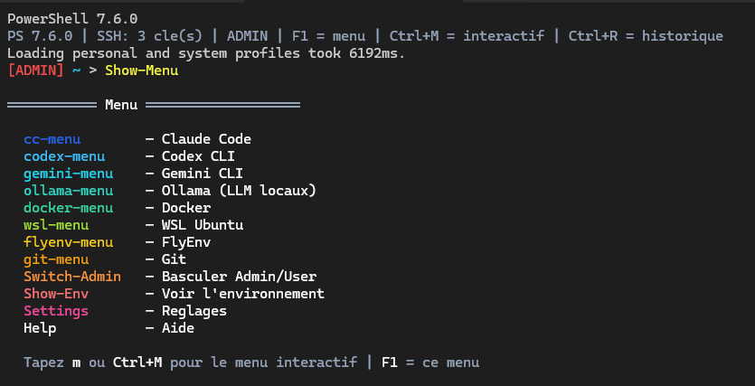
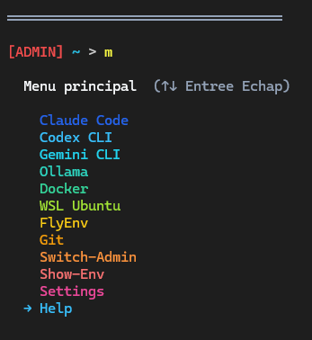
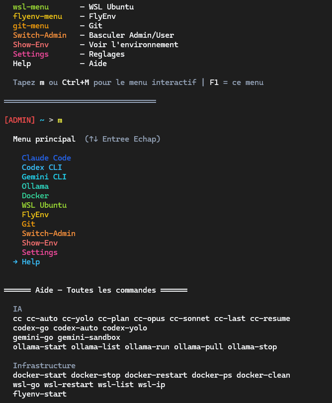

# PowerShell Profile Stack

Stack terminal PowerShell 7.6+ personnalisee pour Windows Terminal.

Profil complet avec menu interactif natif, palette ANSI true color, integration d'outils IA (Claude Code, Codex, Gemini, Ollama), gestion Docker/WSL, raccourcis Git, et utilitaires systeme.

## Fonctionnalites

- **Menu interactif natif** (`m` / Ctrl+M) — navigation clavier a deux niveaux, zero dependance externe
- **Palette 12 couleurs** en degrade arc-en-ciel (ANSI true color 24-bit)
- **PSReadLine enrichi** — ListView, CompletionPredictor, historique incremental
- **PSFzf** — Ctrl+R (historique fuzzy), Ctrl+T (fichiers)
- **Terminal-Icons** — icones Nerd Font dans `ls`
- **zoxide** — navigation intelligente (`z <mot-cle>`)
- **SSH automatique** — chargement des cles au demarrage
- **8 sections d'outils** avec sous-menus dedies
- **Prompt custom** avec branche Git et indicateur Admin
- **Script de reinstallation** idempotent pour Windows frais

## Apercu

### Show-Menu (F1) — Aide-memoire statique



### Menu interactif `m` (Ctrl+M) — Navigation clavier



### Navigation et execution



## Structure du projet

```
powershell-profile-stack/
├── scripts/
│   ├── Microsoft.PowerShell_profile.ps1       # Profil PS 7 complet
│   ├── Microsoft.PowerShell_profile_ps51_redirect.ps1  # Redirect PS 5.1 → pwsh
│   └── install-powershell-stack.ps1           # Script d'installation complete
├── docs/
│   ├── guide-utilisation.md                   # Guide complet d'utilisation
│   ├── palette-couleurs.md                    # Reference palette ANSI
│   └── reinstallation-windows.md              # Procedure de reinstallation
├── README.md
├── LICENSE.md
└── .gitignore
```

## Installation rapide

### Prerequis

- Windows 10/11 avec [Windows Terminal](https://aka.ms/terminal)
- Une [Nerd Font](https://www.nerdfonts.com/) installee (ex: FiraCode Nerd Font)
- PowerShell 7.2+ (`winget install Microsoft.PowerShell`)

### Installation

```powershell
# Cloner le repo
git clone https://github.com/audi63/powershell-profile-stack.git

# Executer le script d'installation
& ".\powershell-profile-stack\scripts\install-powershell-stack.ps1"

# Fermer et rouvrir le terminal
```

Le script installe automatiquement :

| Type | Composants |
|---|---|
| **Modules** | PSReadLine, CompletionPredictor, PSFzf, Terminal-Icons, SecretManagement, SecretStore, BurntToast, ConsoleGuiTools |
| **Binaires** | fzf, zoxide, gum |
| **Profils** | PS 7 (custom) + redirect PS 5.1 → pwsh |

### Ce qui n'est PAS installe

- oh-my-posh (prompt custom deja en place)
- posh-git (branche Git deja dans le prompt)

## Raccourcis clavier

| Raccourci | Action |
|---|---|
| `F1` | Menu statique (aide-memoire) |
| `Ctrl+M` | Menu interactif (navigation ↑↓) |
| `Ctrl+R` | Historique fuzzy (fzf) |
| `Ctrl+T` | Recherche fichiers (fzf) |
| `Tab` | Completion menu deroulant |

## Commandes rapides

| Commande | Description |
|---|---|
| `m` | Menu interactif a deux niveaux |
| `Show-Menu` | Aide-memoire statique |
| `Help` | Liste de toutes les commandes |
| `Show-Env` | Versions des outils installes |
| `Settings` | Ouvrir le profil dans l'editeur |
| `Switch-Admin` | Basculer console Admin/User |
| `z <mot>` | Navigation intelligente zoxide |

## Documentation

- [Guide d'utilisation complet](docs/guide-utilisation.md)
- [Palette de couleurs ANSI](docs/palette-couleurs.md)
- [Procedure de reinstallation Windows](docs/reinstallation-windows.md)

## Stack technique

- PowerShell 7.6+
- Windows Terminal (VT100/ANSI)
- ANSI true color 24-bit (`\e[38;2;R;G;Bm`)
- `[Console]::ReadKey` + `StringBuilder` pour le menu natif
- Sequences ANSI relatives (`\e[nA`, `\e[2K`) pour le redraw en place

## Auteur

[@audi63](https://github.com/audi63)

## Licence

Tous droits reserves. Voir [LICENSE.md](LICENSE.md).
